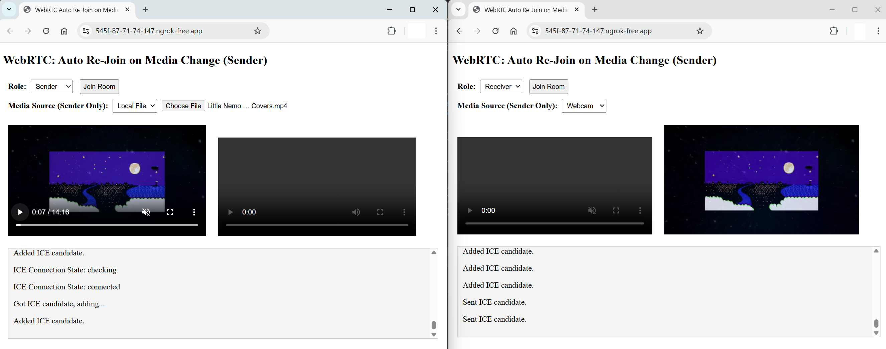

# WebRTC Auto Re-Join Demo



## Introduction

**WebRTC (Web Real-Time Communication)** enables real-time audio, video, and data transfer between peers directly in the browser, without needing plugins or extra software. In this example, we use a simple **signaling server** (via Python + Socket.IO) that lets a "Sender" and a "Receiver" exchange **Session Descriptions** (SDP) and **ICE candidates** automatically. If the Sender changes media (e.g., from file to webcam), it re-joins and restarts the session fresh, ensuring no stale data causes errors.

## How It Works

1. **Sender** or **Receiver** joins a “room” via a simple Python/Socket.IO server.
2. **Sender** shares media (webcam or local file) and creates an SDP offer.
3. **Receiver** automatically responds with an SDP answer.
4. Both sides exchange ICE candidates for NAT traversal.
5. If the **Sender** changes media source, it tears down the old connection, re-joins, and starts a new session.

## Installation and Usage

1. **Clone or Download** this repository.
2. **Install Dependencies**:
   ```bash
   pip install flask flask-socketio eventlet
